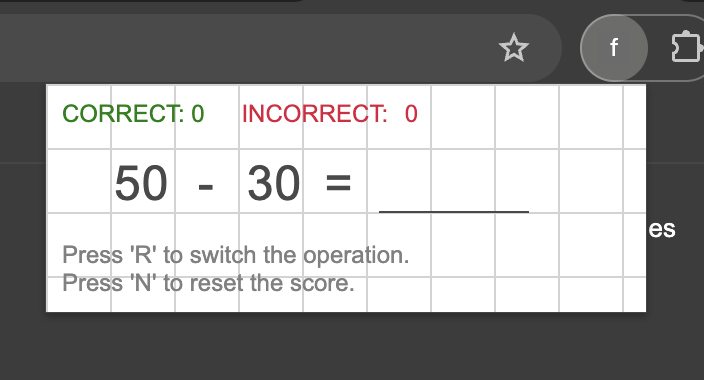

# Fer Maths

Little tool I use to practice basic arithmetic whenever I’m bored. It’s super easy to use and makes sharpening my math skills feel simple and accessible, without any hassle.

I also mappped to ctrl + 4 in my chrome so I can access super fast.

Feel free to try this plugin. To do it locally first you must build and then you can load it as unpacked in Chrome Extensions tab

